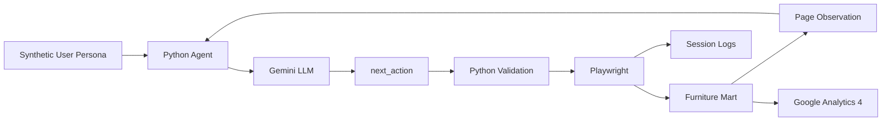

# 🤖 AI Web Analytics Agent

### Synthetic user behaviour analysis using Gemini and Playwright

This project is an **AI-powered synthetic web-user agent** designed to analyse how users interact with a web application.

Instead of relying only on manually defined test scenarios or real user traffic, the agent uses **LLM-driven personas** to simulate different types of website visitors. The agent observes the website, decides what a user would do next, performs the action through a real browser, and records the resulting journey for web analytics.

The current experiment uses **Sarvotam Furniture (Furniture Mart)** as the target web application.

🌐 **Target Website:** https://furniture-mart-ps3p.onrender.com/

---

## 🏗️ System Architecture

The system follows an **observation → decision → action** loop.



### How it works

1. A **synthetic persona** defines the type of user and their browsing goal.
2. The Python agent opens the target website using Playwright.
3. The agent collects a structured observation of the current page.
4. The observation is provided to Gemini.
5. Gemini selects the next action using the `next_action` function.
6. Python validates the action before execution.
7. Playwright performs the action in the browser.
8. The resulting page is observed again.
9. The cycle continues until the persona finishes or the session reaches its safety limits.
10. Session information is recorded for later analytics.

---

## 🧠 AI Agent

Gemini is the only supported LLM provider.

The agent uses a single structured function:

```text
next_action
```

Possible actions include:

```text
open_link
search
view_product
go_back
add_to_cart
view_cart
finish
```

The LLM does **not** directly control the browser.

Instead, the interaction is controlled through Python:

```text
Gemini
   │
   │ structured action
   ▼
Python Validation
   │
   │ validated action
   ▼
Playwright
   │
   ▼
Web Application
```

Python acts as the control and safety layer between the LLM and the browser.

It validates:

- Allowed actions
- Target URLs
- Observed links and products
- Website origin
- Persona permissions
- Cart permissions
- Session limits
- Repeated actions

---

## 👥 Synthetic User Personas

The agent can run sessions using different synthetic user behaviours.

Example personas include:

```text
Casual Browser
Product Researcher
Goal-Oriented Buyer
Returning Customer
```

Each persona can have a different objective and browsing style.

This allows the same website to be explored from multiple simulated user perspectives.

---

## 📊 Web Analytics

The project combines two sources of analytics.

### Synthetic Agent Analytics

The agent records information from its synthetic sessions, including:

- User persona
- Actions performed
- Pages visited
- Product views
- Searches
- Cart interactions
- Session duration
- Number of actions
- Journey path
- Session outcome

This data can be used to analyse how different synthetic users navigate the website.

#### Google Analytics 4

Google Analytics 4 is configured on the target website for page-view analytics.

GA4 provides an independent view of website activity, while the synthetic-agent logs provide detailed information about the agent's decisions and journeys.

---

## 🌐 Target Web Application

The current experiment uses **Sarvotam Furniture (Furniture Mart)** as the target web application.

The website is a Django-based furniture storefront that allows visitors to:

- Browse furniture products
- Search for products
- View product details
- Add products to a shopping cart
- Manage cart quantities
- Create accounts
- Submit showroom and product enquiries

The website serves as the **environment in which the synthetic users operate**.

The primary focus of this repository is the AI agent and the web analytics experiment, rather than the storefront itself.

🌐 **Live Website:** https://furniture-mart-ps3p.onrender.com/

---

## 🚀 Getting Started

### 1. Clone the repository

```bash
git clone https://github.com/simran2104/ai-web-analytics-agent.git
cd ai-web-analytics-agent
```

### 2. Install dependencies

```bash
pip install -r requirements.txt
```

### 3. Install Playwright Chromium

```bash
python -m playwright install chromium
```

### 4. Configure Gemini

Set the Gemini API key in your shell environment.

#### Windows PowerShell

```powershell
$env:GEMINI_API_KEY="YOUR_KEY_HERE"
```

The Gemini API key is read from the `GEMINI_API_KEY` environment variable.

---

## 🧪 Testing

### Gemini Smoke Test

Run the structured Gemini test without launching a browser:

```bash
python main.py --gemini-test
```

This verifies that Gemini can return a valid structured `next_action`.

---

### 🌐 Browser Smoke Test

Run the Playwright browser test:

```bash
python main.py --browser-test
```

This test:

- Launches Chromium
- Opens the configured Furniture Mart website
- Handles Render cold starts
- Waits for the website to become available
- Extracts a compact page observation
---

## 🤖 Run the AI Agent

After the Gemini smoke test succeeds, run one synthetic-user session:

```bash
python main.py --agent-test --persona casual_browser
```

Chromium is visible by default.

To run the browser in the background, set:

```json
"headless": true
```

in:

```text
agent_config/settings.json
```

Gemini receives exactly one structured function:

```text
next_action
```

The Python agent validates the returned action and then dispatches it to Playwright.

Cart actions remain disabled unless both global configuration and persona permissions allow them.

The agent does not perform checkout, payments, or online purchases.

---

## 🔍 Diagnose Structured Tool Calls

To test the active Gemini provider against a live homepage observation:

```bash
python diagnose_llm.py
```

The diagnostic provides one `next_action` schema and a fresh homepage observation.

It reports `PASS` only when Gemini returns exactly one schema-valid structured action.

Gemini logs record request metadata but do not store API credentials.

--- 


## 🛠️ Technology Stack

### AI & Agent

- Python
- Google Gemini
- Structured Function Calling

### Browser Automation

- Playwright
- Chromium

### Target Web Application

- Django
- Python
- HTML5
- CSS3
- JavaScript
- Bootstrap
- SQLite

### Analytics

- Google Analytics 4
- Synthetic session/event logs

### Deployment

- Render

### Version Control

- Git
- GitHub
